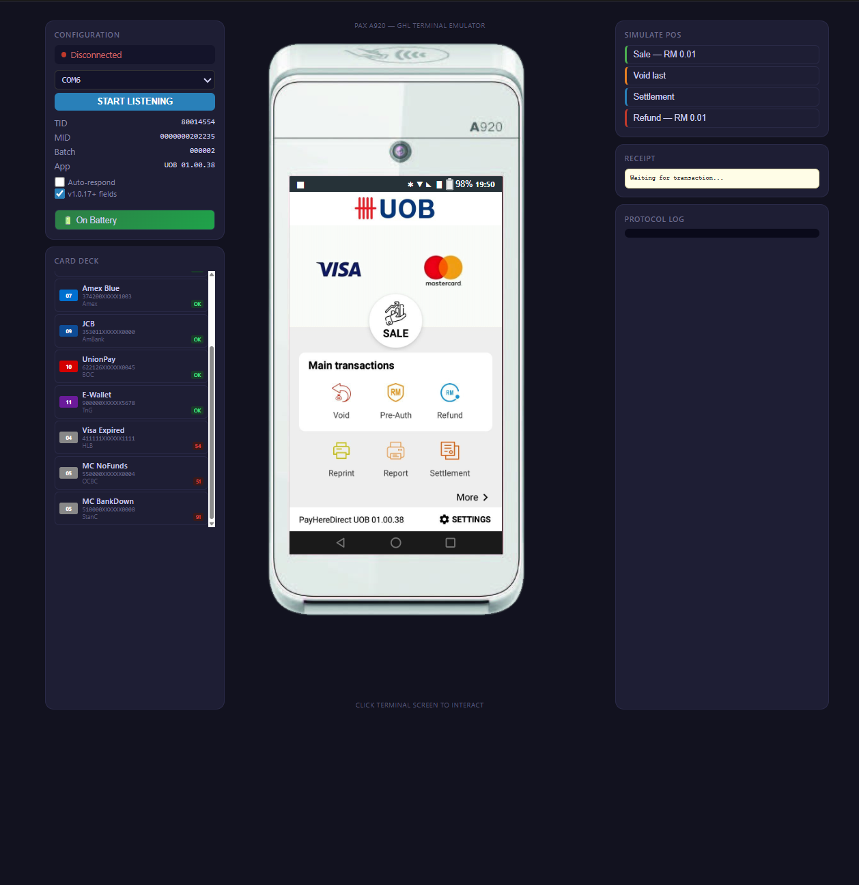

# PAX A920 — GHL Terminal Emulator

> Virtual PAX A920 payment terminal for POS integration development.  
> No hardware needed. Runs in your browser or over virtual serial.

### [▶ Launch Live Demo](https://deadboy18.github.io/PAX-A920-Emulator/)

<p align="center">
  <strong>🌐 Web Emulator</strong> — Interactive browser-based terminal with real device UI<br>
  <strong>🔌 Serial Emulator</strong> — Python RS232 emulator with byte-identical GHL ECR protocol responses
</p>

<p align="center">
  
</p>

---

## What is this?

A pixel-perfect emulator of the **PAX A920** payment terminal running **GHL PayHereDirect UOB firmware (v01.00.38)** on **Android 7.1.2**.

Built primarily for developers in **Malaysia** integrating POS systems with GHL terminals. Every screen, sound, and serial response is matched to the real hardware. The ECR protocol and packet structure is universal across all GHL-configured PAX terminals, so the emulator can be adapted for other Southeast Asian markets with minimal changes (card type codes may vary by region — e.g., MyDebit is Malaysia-specific).

This project includes **two emulators** that serve different purposes:

| | Web Emulator | Serial Emulator |
|---|---|---|
| **File** | `GHL_Terminal_Emulator_Web.html` | `GHL_Terminal_Emulator.py` |
| **Purpose** | Visual demo, training, UI prototyping | POS software development and testing |
| **Runs in** | Any browser (desktop/mobile) | Python + virtual COM ports |
| **Input** | Click/tap on screen | Serial packets from your POS app |
| **Output** | Visual + audio feedback | Byte-identical GHL protocol responses |
| **Requires** | Nothing (single HTML file) | Python 3, pyserial, com0com |

---

## About GHL

**GHL Systems** (now **NTT DATA Payment Services**) is one of the largest payment terminal providers in Southeast Asia, founded in 1994 in Kuala Lumpur, Malaysia. They supply and manage POS terminals for banks and merchants across Malaysia, Thailand, Philippines, Indonesia, and other ASEAN markets — with over **500,000 payment terminals** deployed.

In May 2024, NTT DATA Japan acquired GHL Systems, and the company was rebranded to **NTT DATA Payment Services Sdn. Bhd.** in November 2024. Despite the name change, the terminals, ECR protocol, and integration process remain the same. Most people in the industry still refer to them as "GHL".

This emulator handles the **ECR (Electronic Cash Register) protocol** — the serial communication standard that lets your POS software talk to the physical terminal to trigger card payments, voids, refunds, and settlements.

> **Regional note:** While this was built and tested against terminals deployed in Malaysia, the ECR protocol and packet structure is the same across all GHL-configured PAX terminals. The framing, checksums, and command structure are universal — only card type codes and acquirer-specific fields may vary by country.

---

## 🌐 Web Emulator

A single self-contained HTML file that recreates the full PAX A920 experience in your browser. No server, no dependencies, no install — just open the file.

### Features

**Authentic Device Shell**
- PAX A920 terminal body rendered with accurate proportions
- Real device screenshots for Home Menu, More Menu, and Settings screens
- Pixel-mapped hotspot overlays for every on-screen button
- Android 7.1.2 status bar with battery simulation, clock, and signal indicators
- Android navigation bar (Back, Home, Recent)

**Complete Transaction Flow**
- Full GHL payment flow: Menu → Sale → Amount Entry → Card Tap → Processing → Approve/Decline → Receipt
- On-screen numeric keypad with amount entry (RM format with auto decimal)
- Card selection from a built-in deck of 11 test cards (Visa, Mastercard, MyDebit, Amex, JCB, UnionPay, E-Wallet)
- 4 decline scenarios: Expired Card, Insufficient Funds, Wrong PIN, Bank Unreachable
- Void transaction flow with supervisor PIN entry
- Settlement and Refund stubs

**Sound and Haptic Feedback**
- Android 7.1.2 tap sound — pre-rendered 35ms WAV sample (3-layer synthesis: click transient + tonal body + low thump), embedded as base64
- Haptic feedback via Vibration API (12ms pulse matching Android `KEYBOARD_TAP`) for phones and tablets
- Terminal-specific audio cues matched to the real device:

| Event | Sound |
|---|---|
| Button tap (SALE, keypad, OK) | Android tap — 35ms synthesised click |
| Card tap | Double beep at 2400Hz |
| Waiting for card | Double beep at 1200Hz |
| Transaction approved | Ascending tone 800→1200Hz |
| Transaction declined | Descending tone 400→300Hz |
| Amount entry prompt | TTS: "Please input amount" |
| Card present prompt | TTS: "Please use your card" |

**Three Full Screenshot Screens**
- **Home Menu** — Sale, Void, Pre-Auth, Refund, Reprint, Report, Settlement, More, Settings
- **More Menu** — Offline Sale, IPP Sale, View Transactions, Print Detail, Print A Transaction, Reprint Settlement, QR Inquiry, CUP Logon, CUP Auth Menu, Setup, Terminal eGuide, TPMS Download
- **Settings** — Network, WiFi, Bluetooth, Sound, Home Screen, Setup, About, Quit

**POS Controls Panel**
- Simulated hardware buttons: Cancel (red ✕), Backspace (yellow ⌫), Menu (blue ☰), Enter (green ✓)
- Card deck with 11 test cards showing masked PAN, bank name, and expected result
- Activity log showing all actions and state transitions
- Configurable TID, MID, Batch number, and App version

### Quick Start

1. Download `GHL_Terminal_Emulator_Web.html`
2. Open in any browser
3. Tap **SALE** on the terminal screen
4. Enter an amount and press **OK**
5. Select a card from the deck and tap **TAP CARD HERE**
6. Watch the transaction flow through to approval or decline

> **Live Demo:** This repo is configured for GitHub Pages — visit the live demo at `https://deadboy18.github.io/PAX-A920-Emulator/`

---

## 🔌 Serial Emulator (Python)

A full GHL ECR protocol emulator that communicates over virtual serial ports. Your POS software talks to it exactly like a real PAX A920 — same packets, same timing, same responses.

### Architecture

```
┌──────────────────┐      Virtual COM Pair       ┌──────────────────────┐
│  YOUR POS APP    │  COM5 ◄══════════════► COM6  │  SERIAL EMULATOR     │
│  (any language)  │      (com0com bridge)        │  (GHL_Terminal_      │
│                  │                              │   Emulator.py)       │
│  Sends TX packet │  ──────────────────────────► │  Receives & parses   │
│                  │                              │  Shows on screen     │
│                  │                              │  User taps card      │
│  Gets RX packet  │ ◄──────────────────────────  │  Sends RX response   │
└──────────────────┘                              └──────────────────────┘
```

### Setup

**Step 1 — Install com0com (Virtual COM Port Driver)**

com0com creates paired virtual serial ports in Windows Device Manager.

1. Download from [com0com.sourceforge.net](https://com0com.sourceforge.net/) or the [signed version](https://github.com/nicjac/signed-com0com/releases)
2. Run the installer
3. Open **com0com Setup** from Start Menu
4. Create a port pair: `COM5 ↔ COM6` (or any numbers you prefer)
5. Verify in **Device Manager → Ports (COM & LPT)** — both ports should be listed

> If you see ports named `CNCA0` / `CNCB0`, rename them to `COM5` / `COM6` in the com0com Setup utility.

**Step 2 — Install Python dependencies**

```bash
pip install pyserial
```

**Step 3 — Run**

```bash
python GHL_Terminal_Emulator.py
```

1. Select the emulator port (e.g. `COM6`) from the dropdown
2. Click **START LISTENING**
3. Point your POS software at the other port (e.g. `COM5`)
4. Send a transaction — the emulator will receive and respond

### Protocol Compatibility

Responses are **byte-for-byte identical** to a real GHL terminal:

- Packet structure: `[STX 0x02] [Payload] [8-byte XOR Checksum] [ETX 0x03]`
- Payload field offsets per GHL ECR Spec v1.0.17
- Card number format: 2-byte length prefix + masked PAN
- Error codes: `00` (approved), `CT` (cancelled), `51` (insufficient funds), `54` (expired), `55` (wrong PIN), `91` (bank unreachable)
- Card type codes: `04` (Visa), `05` (Mastercard), `07` (Amex), `08` (MyDebit), `09` (JCB), `10` (UnionPay), `11` (E-Wallet)
- XOR checksum algorithm: 8-byte block XOR with 0xFF padding

**If your code works with this emulator, it will work with a real terminal.**

### Serial Emulator Features

- **Firmware toggle** — switch between v1.0.17+ (125-byte response with TID/MID/Batch) and legacy 96-byte format
- **Auto-respond mode** — automatically approves with the selected card for automated and CI testing
- **Configurable delay** — simulate real bank processing time (e.g. 2–4 seconds)
- **Receipt output** — formatted receipt matching real terminal output
- **Protocol log** — full hex TX/RX dump for debugging

---

## 🃏 Test Card Deck

Both emulators share the same card deck covering all major payment methods in Malaysia:

| # | Card | Bank | Type | Code | Result |
|---|---|---|---|---|---|
| 01 | MyDebit | Public Bank | Debit | 08 | ✅ Approve (no PIN for tap) |
| 02 | Visa Platinum | Maybank | Credit | 04 | ✅ Approve |
| 03 | Mastercard Gold | CIMB Bank | Credit | 05 | ✅ Approve |
| 04 | Visa Classic | RHB Bank | Credit | 04 | ✅ Approve |
| 05 | Amex Blue | Amex Direct | Credit | 07 | ✅ Approve |
| 06 | JCB Standard | AmBank | Credit | 09 | ✅ Approve |
| 07 | UnionPay | Bank of China (MY) | Credit | 10 | ✅ Approve |
| 08 | E-Wallet (TnG) | Touch 'n Go | E-Wallet | 11 | ✅ Approve (no PIN) |
| 09 | Visa (Expired) | Hong Leong Bank | Credit | 04 | ❌ Decline: 54 |
| 10 | MC (No Funds) | OCBC Bank | Credit | 05 | ❌ Decline: 51 |
| 11 | Visa (Wrong PIN) | Alliance Bank | Credit | 04 | ❌ Decline: 55 |

---

## 📱 Mobile Support

The web emulator is fully functional on phones and tablets:

- **Touch interaction** — tap buttons directly on the terminal screen
- **Haptic feedback** — 12ms vibration pulse on every button tap (Android Chrome, Samsung Internet, Firefox Mobile)
- **Responsive layout** — adapts to screen size
- **Add to Home Screen** — works as a standalone web app

---

## 🛠 Technical Details

**Web Emulator**
- Single self-contained HTML file (~300KB) — all images embedded as base64 JPEG, audio as base64 WAV
- Web Audio API for sound synthesis, Vibration API for haptics
- CSS-only terminal device rendering with percentage-based screen overlay
- Screenshot-based screens with pixel-mapped hotspot overlays
- Zero dependencies — no frameworks, no build tools, no server

**Serial Emulator**
- Python 3 with Tkinter GUI (1,361 lines)
- pyserial for COM port communication
- Threaded serial listener for non-blocking I/O
- Full GHL ECR protocol implementation per Spec v1.0.17
- XOR-based checksum validation and generation

---

## 📁 Repository Structure

```
PAX-A920-Emulator/
├── index.html                        Web emulator (GitHub Pages entry point)
├── GHL_Terminal_Emulator.py          Python serial emulator
├── README.md                         Documentation
├── emulator_config.json              Auto-saved settings (created on first run)
└── screenshots/
    └── emulator-full.png             Full UI screenshot
```

---

## 🌏 Regional Adaptability

This emulator is built for the **Malaysian market** but the underlying architecture is designed to be adaptable:

- **ECR protocol** — universal across all GHL/NTT DATA terminals in Southeast Asia
- **Card type codes** — `04` (Visa), `05` (Mastercard), `07` (Amex) are standard; region-specific types like `08` (MyDebit) or `11` (E-Wallet) can be swapped for local equivalents
- **Bank names and PANs** — configurable in the card deck
- **Currency** — amount formatting can be changed from RM to any currency
- **Screenshots** — can be replaced with captures from terminals in other markets (Thailand, Philippines, Indonesia, etc.)

If you're working with GHL terminals in another ASEAN market, fork this repo and swap the region-specific bits. The protocol layer doesn't change.

---

## 🔗 Related Projects

- [GHL-POS-Integration](https://github.com/deadboy18/GHL-POS-Integration) — C# POS integration library for GHL terminals
- [ghl-pos-integration-c](https://github.com/deadboy18/ghl-pos-integration-c) — C implementation of the GHL ECR protocol
- [GHL-Integration-Tools](https://github.com/deadboy18/GHL-Integration-Tools) — Developer toolkit for GHL terminal integration

---

## 📄 License

MIT License — free for commercial and personal use.

---

<p align="center">
  <sub>Built for the Southeast Asian payment developer community</sub>
</p>
